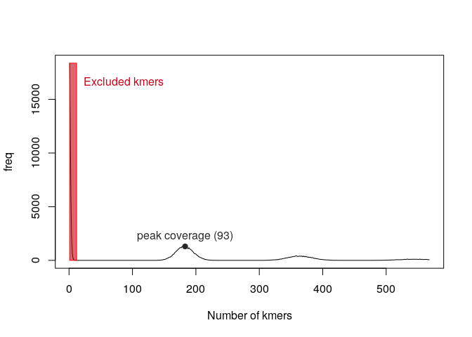

<!-- README.md is generated from README.Rmd. Please edit that file -->
WhatToExpect
============

The goal of WhatToExpect is to take unaligned genomic sequencing reads and genrate estiatmes for genome size, GC-content and (in the case of genomes with ischore-like structures) the expected length-distributions for AT- and GC-rich regions.

This is very much at an early stage of development, but feedback, PRs and issues are welcome.

Automated genome size estimates
-------------------------------

I have an approximately 130kb 'fake' reference genome `isnt/exdata`:

``` r
ref_len <- length(ape::read.dna("inst/exdata/fake_ref.fasta", "fasta"))
ref_len/1e3
#> [1] 131.469
```

From this, I have simulated 20 bp PE reads...

``` r
reads <- list.files("inst/exdata", "*.fq", full.names=TRUE)
reads
#> [1] "inst/exdata/fake_reads_1.fq" "inst/exdata/fake_reads_2.fq"
```

So, let's use the reads to estimate the genome size. The first step is to use `jellyfish` to count the occurance of kmers. The output here is binary file into which `jellyfish` dumpts the counts:

``` r
hist_file <- jfish_count_kmers(reads, k=9, starting_size="1M")
#> kmer counts written to mer_counts.jf
hist_file
#> [1] "mer_counts.jf"
```

We can use that file to read the results into a two-column kmer-spectrum. Finally, the function `est_genome_size` autmoates teh process of precicting genome size and produces a plot that that displays the key criteria used to make the calculation (so you can check it looks right).

``` r
kmer_hist <- read_jfish(hist_file)
size_est <- est_genome_size(kmer_hist, unit="b", plot=TRUE, x_cutoff=0.98)
```



``` r
size_est/1e3
#> [1] 130.734
```

In this case, we get a very nice estimate of the "true" genome size from the sequencing reads:

``` r
dotchart(c(size_est,ref_len), 
         labels=c("Estimate", "True genome size"),
         xlim=c(0,ref_len))
```


